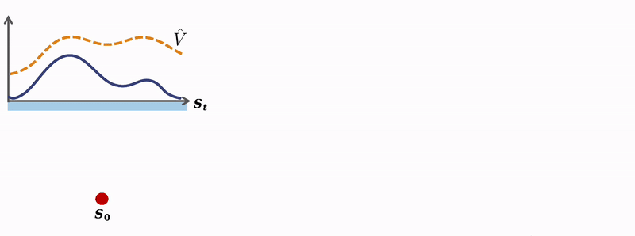

# TD-M(PC)^2: Improving Temporal Difference MPC Through Policy Constraint

[Paper](https://arxiv.org/abs/2502.03550) [Website](https://darthutopian.github.io/tdmpc_square/)

We present <u>T</u>emporal <u>D</u>ifference Learning for <u>M</u>odel <u>P</u>redictive <u>C</u>ontrol with <u>P</u>olicy <u>C</u>onstraint (<strong>TD-M(PC)\(^2\)</strong>), a simple yet effective approach built on TD-MPC2 that allows a planning-based MBRL algorithm to better exploit complete off-policy data generated from planner. This repo is built on top of <a href="https://humanoid-bench.github.io" target="_blank"><code>HumanoidBench</code></a>, it contains example implementation TD-M(PC)^2 to reproduce results in the paper.



## Directories
Structure of the repository:
* `data`: Weights of the low-level skill policies
* `dreamerv3`: Training code for dreamerv3
* `humanoid_bench`: Core benchmark code
    * `assets`: Simulation assets
    * `envs`: Environment files
    * `mjx`: MuJoCo MJX training code
* `jaxrl_m`: Training code for SAC
* `ppo`: Training code for PPO
* `tdmpc2`: Training code for TD-MPC2
* `tdmpc_square`: Training code for TD-MPC-square

## Installation
Create a clean conda environment:
```
conda create -n tdmpc-square python=3.11
conda activate tdmpc-square
```

Then, install the required packages:
```
# Install HumanoidBench
pip install -e .

# jax GPU version
pip install "jax[cuda12]==0.4.28"
# Or, jax CPU version
pip install "jax[cpu]==0.4.28"

# Install tdmpc-square, minimal requirement
pip install -r requirements_tdmpc_square.txt
```

To run the baselines:
```
# Install jaxrl
pip install -r requirements_jaxrl.txt

# Install dreamer
pip install -r requirements_dreamer.txt
```

## Env Test
This section is for `HumanoidBench` sanity check. Recommanded but not required.

### Test Environments with Random Actions
```
python -m humanoid_bench.test_env --env h1hand-walk-v0
```

### Test Environments with Hierarchical Policy and Random Actions
```
# Define checkpoints to pre-trained low-level policy and obs normalization
export POLICY_PATH="data/reach_two_hands/torch_model.pt"
export MEAN_PATH="data/reach_two_hands/mean.npy"
export VAR_PATH="data/reach_two_hands/var.npy"

# Test the environment
python -m humanoid_bench.test_env --env h1hand-push-v0 --policy_path ${POLICY_PATH} --mean_path ${MEAN_PATH} --var_path ${VAR_PATH} --policy_type "reach_double_relative"
```

### Test Low-Level Reaching Policy (trained with MJX, testing on classical MuJoCo)
```
# One-hand reaching
python -m humanoid_bench.mjx.mjx_test --with_full_model 

# Two-hand reaching
python -m humanoid_bench.mjx.mjx_test --with_full_model --task=reach_two_hands --folder=./data/reach_two_hands
```

### Change Observations
As a default, the environment returns a privileged state of the environment (e.g., robot state + environment state). To get proprio, visual, and tactile sensing, set `obs_wrapper=True` and accordingly select the required sensors, e.g. `sensors="proprio,image,tactile"`. When using tactile sensing, make sure to use `h1touch` in place of `h1hand`.
Full test instruction:
```
python -m humanoid_bench.test_env --env h1touch-stand-v0 --obs_wrapper True --sensors "proprio,image,tactile"
```


## Training
For HumanoidBench tasks:
```
# Define TASK
export TASK="h1hand-sit_simple-v0"

# Train TD-M(PC)^2
python -m tdmpc_square.train disable_wandb=False wandb_entity=[WANDB_ENTITY] exp_name=tdmpc task=humanoid_${TASK} seed=0
```
For DMControl tasks:
```
For HumanoidBench tasks:
export TASK="dog-trot"

python -m tdmpc_square.train disable_wandb=False wandb_entity=[WANDB_ENTITY] exp_name=tdmpc task=${TASK} seed=0
```


### Baseline 

For TD-MPC, one can set actor_mode to 'sac' in `tdmpc_square/config.yaml`.
```
# Train TD-MPC2
python -m tdmpc2.train disable_wandb=False wandb_entity=[WANDB_ENTITY] exp_name=tdmpc task=humanoid_${TASK} seed=0

# Train DreamerV3
python -m embodied.agents.dreamerv3.train --configs humanoid_benchmark --run.wandb True --run.wandb_entity [WANDB_ENTITY] --method dreamer --logdir logs --task humanoid_${TASK} --seed 0

# Train SAC
python ./jaxrl_m/examples/mujoco/run_mujoco_sac.py --env_name ${TASK} --wandb_entity [WANDB_ENTITY] --seed 0

# Train PPO (not using MJX)
python ./ppo/run_sb3_ppo.py --env_name ${TASK} --wandb_entity [WANDB_ENTITY] --seed 0
```

## Implementation
This repository offers one possible implementation of the proposed framework (used to reproduce results in the paper), which is largely built upon the official implementation of <a href="https://github.com/nicklashansen/tdmpc2" target="_blank"><code>TD-MPC2</code></a>, to which we attribute significant credit. 

In fact, one can simple modify <a href="https://github.com/nicklashansen/tdmpc2" target="_blank"><code>TD-MPC2</code></a> and acquire similar performance in the paper through the following steps:  

Modify the buffer to store `mu` and `std` of the planner in `tdmpc2/tdmpc2/trainer/online_trainer.py` and `tdmpc2/tdmpc2/common/buffer.py` (Extra one line code needed). 

In `tdmpc2/tdmpc2.py`, pass `mu` and `std` into function `TDMPC2.update_pi` add policy regularization term by replacing
```python
pi_loss = ((self.cfg.entropy_coef * log_pis - qs).mean(dim=(1, 2)) * rho).mean()
```
into
```python
std = torch.max(std, self.cfg.min_std * torch.ones_like(std))
eps = (pis - mu) / std
log_pis_prior = math.gaussian_logprob(eps, std.log()).mean(dim=-1)
log_pis_prior = self.scale(log_pis_prior) if self.scale.value > self.cfg.scale_threshold else torch.zeros_like(log_pis_prior)
q_loss = ((self.cfg.entropy_coef * log_pis - qs).mean(dim=(1, 2)) * rho).mean()
prior_loss = - (log_pis_prior.mean(dim=-1) * rho).mean()
pi_loss = q_loss + self.cfg.prior_coef * prior_loss
```
Moreover, one can achieve similar performance by a even more simple modification:
directly adding a BC loss to the policy learning target
```python
q_loss = ((self.cfg.entropy_coef * log_pis - qs).mean(dim=(1, 2)) * rho).mean()
prior_loss = (((pis - action) ** 2).sum(dim=-1).mean(dim=1) * rho).mean()
pi_loss = q_loss + self.cfg.prior_coef * prior_loss
```


## Citation
```
@article{lin2025td,
  title={TD-M (PC) $\^{} 2$: Improving Temporal Difference MPC Through Policy Constraint},
  author={Lin, Haotian and Wang, Pengcheng and Schneider, Jeff and Shi, Guanya},
  journal={arXiv preprint arXiv:2502.03550},
  year={2025}
}
```